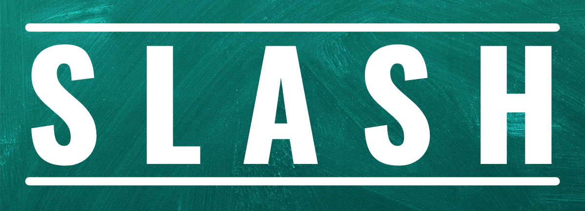

<p align="center"></p>


[](https://doi.org/10.5281/zenodo.10023735)


[](https://github.com/Bala-Logesh/Se23-Slash-61/actions/workflows/node.js.yml)
[](https://codecov.io/gh/NCSU-Group7-SE2021/slash)

Do you love shopping? Are you in search of some good deals while shopping online?! Slash is here to help you look for the best deals!

Slash is a publicly accessible web API framework that allows one to scrape the most popular e-commerce websites to get the best deals on the searched items across multiple e-commerce websites. Currently supported websites include [Walmart](https://www.walmart.com/), [Target](https://www.target.com/), [BestBuy](https://www.bestbuy.com/), [Costco](https://www.costco.com/) and [EBay](https://www.ebay.com/).

- **Fast**: With slash, you can save over 50% of your time by comparing deals across websites within seconds
- **Easy**: Slash introduces easy to use public APIs to filter, sort and search through the search results
- **Powerful**: Produces JSON responses that can be easily customised to bring about the desired output

---

## :rocket: Improvements in Phase-II

We have fixed and added a lot of new features to slash.

1. Enchanced the UI of application to improve user experience and provide a visually appealing design.
2. A new database has been created to facilitate user registration.
3. Implemented user authentication using JSON Web Tokens (JWT).
4. Watchlist Feature: Users can now create and manage watchlists to track the prices of specific items.
5. We have incorporated a scheduler that regularly checks the prices of items on users' watchlists.
6. An email notification is sent to the user when the price of an item in watchlist drops.

---

<p align="center">
  <a href="#movie_camera-checkout-our-video">Checkout our video</a>
  ::
  <a href="#rocket-installation">Installation</a>
  ::
  <a href="#computer-technology-used">Technology Used</a>
  ::
  <a href="#bulb-use-case">Use Case</a>
  ::
  <a href="#page_facing_up-why">Why</a>
  ::
  <a href="#page_facing_up-why">API</a>
  ::
  <a href="#golf-future-roadmap">Future Roadmap</a>
  ::
  <a href="#sparkles-contributors">Contributors</a>
  ::
  <a href="#email-support">Support</a>

</p>

---

## :movie_camera: Checkout our video

<p align="center"></p>

<p align="center"></p>

---

## :rocket: Installation

1. Clone the Github repository to a desired location on your computer. You will need [git](https://git-scm.com/) to be preinstalled on your machine. Once the repository is cloned, you will then `cd` into the local repository.

```
git clone https://github.com/Bala-Logesh/Se23-Slash-61
cd slash
```

2. This project uses Python 3 for the backend and React framework for the frontend.

For the backend setup ensure that [Python](https://www.python.org/downloads/) and [Pip](https://pip.pypa.io/en/stable/installation/) are preinstalled. All the python requirements of the project are listed in the `requirements.txt` file. Use pip to install all of those.

```
pip3 install -r requirements.txt
```

For the frontend setup ensure that [Node](https://nodejs.org/en/) is preinstalled. All the node requirements are listed in `client/package.json` file. Use npm to install all of those.

```
cd client
npm install
```

4. Once all the requirements are installed, you will have to `cd` into the `src` folder. Once in the `src` folder, use the python command to run the `main.py` file.

```
cd src

For Mac
python3 main.py

For Windows
python main.py
```

5. Once the backend is up and running, you will have to `cd` into the `client` folder. Once in the `client` folder, use the node command to start the webserver.

```
cd client
npm run start
```

## :computer: Technology Used

- FastAPI : https://fastapi.tiangolo.com
- ASGI Server - Uvicorn : https://www.uvicorn.org
- Docker : https://www.docker.com

## :bulb: Use Case

- **_Students_**: Students coming to university are generally on a budget and time constraint and generally spend hours wasting time to search for products on Websites. Slash is the perfect tool for these students that slashes all the unnecessary details on a website and helps them get prices for a product across multiple websites.Make the most of this tool in the upcoming Black Friday Sale.
- **_Data Analysts_**: Finding data for any project is one of the most tedious job for a data analyst, and the datasets found might not be the most recent one. Using slash, they can create their own dataset in real time and format it as per their needs so that they can focus on what is actually inportant.

## :file_cabinet: API

We tested the routes using Postman.
The JSON file of the requests can be found here

#### [Postman API JSON](./assets/SE%20Project.postman_collection.json) &#128279;

## :page_facing_up: Why

- In a market where we are spoilt for choices, we often look for the best deals.
- The ubiquity of internet access has leveled the retail playing field, making it easy for individuals and businesses to sell products without geographic limitation. In 2020, U.S. e-commerce sales, receiving a boost due to the COVID-19 pandemic, grew 44% and represented more than 21% of total retail sales, according to e-commerce information source Internet Retailer.
- The growth of e-commerce has not only changed the way customers shop, but also their expectations of how brands approach customer service, personalize communications, and provide customers choices.
- E-commerce market has prompted cut throat competition amongst dealers, which is discernable through the price patterns for products of major market players. Price cuts are somewhat of a norm now and getting the best deal for your money can sometimes be a hassle (even while online shopping).
- This is what Slash aims to reduce by giving you an easy to use, all in one place solution for finding the best deals for your products that major market dealers have to offer!
- Slash in its current form is for students who wish to get the best deals out of every e-commerce site and can be used by anyone who is willing to develop an application that consumes these web APIs.
- Future scope includes anything from a web application with a frontend or any Android or IOS application that utilises these Web APIs at their backend. Anyone can build their own custom application on top of these web APIs.

## :golf: Future Roadmap

- Host website on a public server so customers can use it
- Scrapping from all E-commerce websites
- Real-Time updates using Websocket or Server-Sent Events(SSE) to provide users with immediate notifications when price drop occurs websites
- Third Party authentication using gmail, outlook
- Forget password can be implemented in the existing UI
- Graph functionality to be included
- Database improvisation
- Implement option to sort by rating

- ### [Project 2 README](./proj2/README.md) &#128279;
