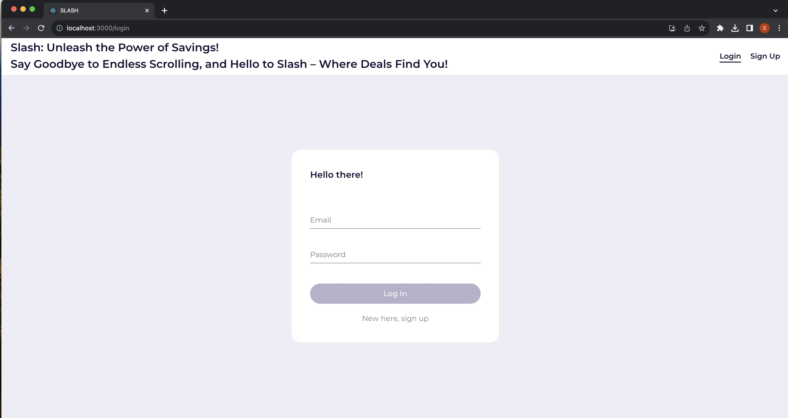
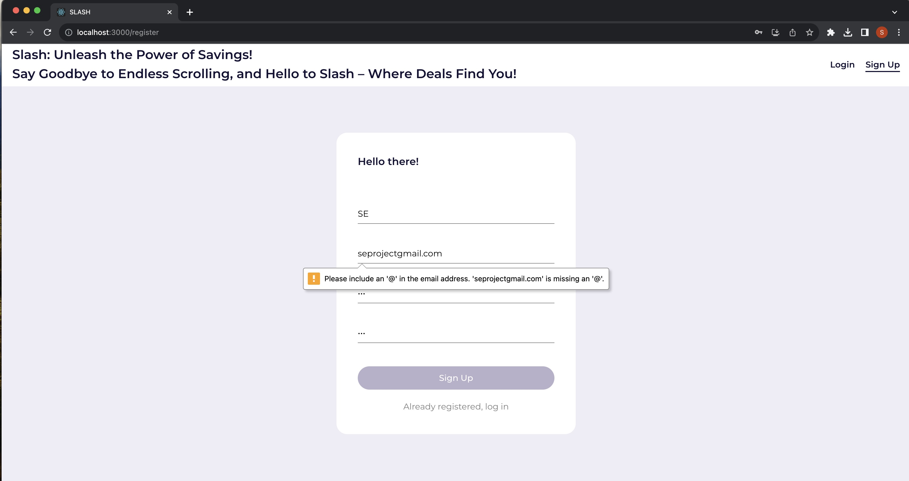
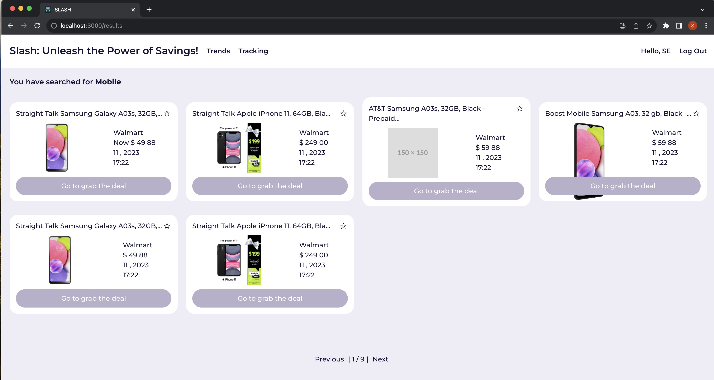
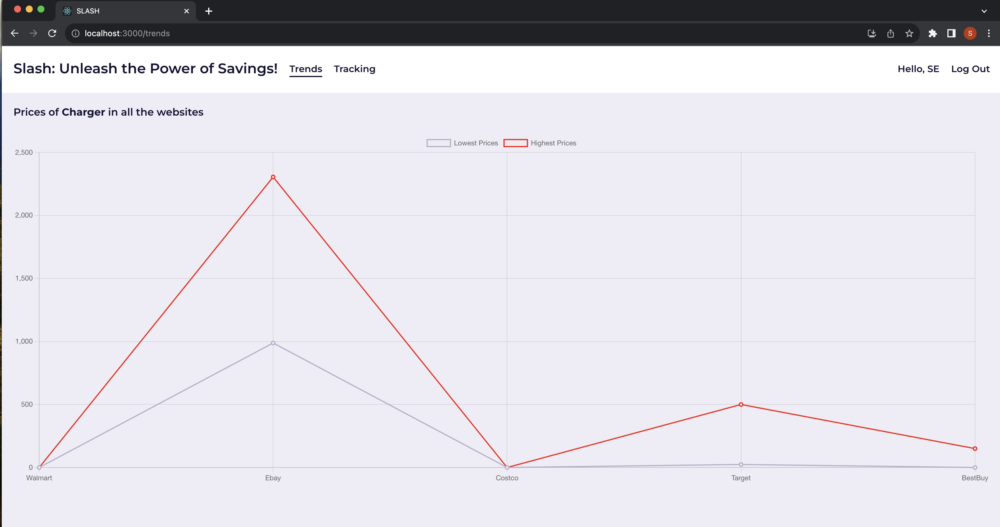
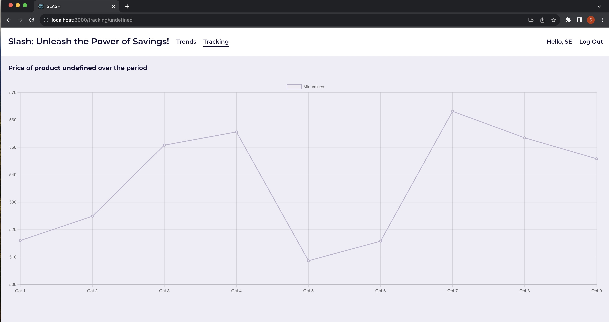
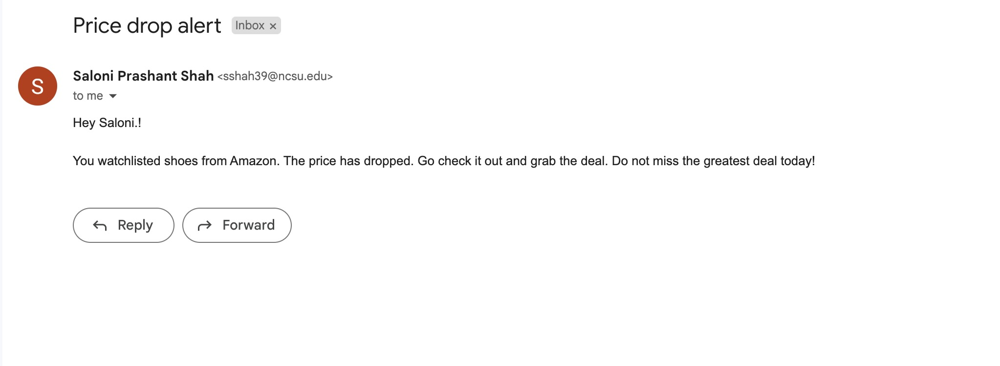

<p align="center"></p>

[](https://opensource.org/licenses/MIT)
[](https://zenodo.org/badge/latestdoi/704785726)
[](https://github.com/salonishah01/CSC510-FALL23-P28-Project3/issues)
[](https://github.com/salonishah01/CSC510-FALL23-P28-Project3/issues?q=is%3Aissue+is%3Aclosed)
[](https://npmjs.com/package/express)
[](https://www.python.org)
[](https://fastapi.tiangolo.com)
[](https://github.com/salonishah01/CSC510-FALL23-P28-Project3/graphs/contributors)

[](https://github.com/ameghana/CSC510-FALL23-P27-Project2/discussions)
[](https://github.com/prettier/prettier)
[](https://codecov.io/gh/NCSU-Group7-SE2021/slash)

# Slash - Ultimate Shopping Companion 🛒✨🚀

## Unleash the Power of Slash for Ultimate Shopping Discoveries!

Are you tired of endlessly scrolling through e-commerce sites, hoping for the perfect deal? Say goodbye to the hassle and welcome Slash, your ultimate companion for discovering incredible online shopping deals! Slash isn't just a web framework; it's a game-changer in the world of online shopping, leveraging FastAPI to scrape and present the best deals from eBay, Amazon, BestBuy, Costco, Target, and Walmart.

## Why Choose Slash?

- **Lightning-Fast Comparison:** Revolutionize your deal-hunting experience. Compare deals from different websites in seconds, saving valuable time!

- **Effortless Navigation:** User-friendly public APIs make it a breeze to filter, sort, and search through results, ensuring you find exactly what you're looking for.

- **Tailored Outputs:** Slash isn't just about finding deals; it's about finding the right deals for you. Generate highly customizable JSON responses to fit your unique preferences.

- Be ready to ask Slash:

  

- And after using our services, we know you'll be like:
  
  

## 🚀 Features Unveiled in Phase II

- **Seamless Authentication:** Enjoy a secure shopping experience with the implementation of a dedicated login page for user authentication.

- **Aesthetically Pleasing UI:** Immerse yourself in a visually appealing user interface, ensuring an enjoyable and intuitive browsing experience.

- **CSV Download:** Slash empowers you further by enabling direct CSV file downloads from the results page, making data accessibility a breeze.

- **Progressive Web Application (PWA):** Embrace the latest web technologies. Slash is now a progressive web application for an enhanced and responsive web experience.

- Impressed yet? Wait, there's more!!
- 

## 🚀 DELTA: Unveiling Phase III from Phase II

Get ready for a shopping experience like never before with Phase III enhancements:

- **Revamped UI:** Our commitment to an enhanced user experience is evident in the redesigned, visually appealing application interface.

- **Streamlined Registration:** Say goodbye to registration headaches. We've introduced a new database to streamline the user registration process.

- **Fortified Security:** Your security is our priority. Slash now employs JSON Web Tokens (JWT) for robust and secure user authentication.

- **Watchlist Feature:** Introducing a revolutionary feature! Create watchlists to monitor the prices of specific items, ensuring you never miss a deal.

- **Automated Monitoring:** We've implemented a scheduler to automatically monitor the prices of items on your watchlists, keeping you informed in real-time.

- **Smart Notifications:** Slash goes the extra mile by sending you email notifications when the price of an item on your watchlist drops.

- **Chrome Extensions:**
  1. **"Search Product"** is a robust browser extension that simplifies online shopping by enabling quick searches for products with lower prices, utilizing features like image-based searches, and providing a user-friendly interface for an efficient and economical shopping experience.
  2. Never miss out on student discounts while shopping online with the **"Student Beans"** Chrome extension, which automatically alerts you to exclusive deals from thousands of brands, providing quick access to verified discount codes and enhancing the savings for university, college, and sixth form students."

## Elevate Your Shopping Game with Slash!
Get ready to redefine yur online shopping experience.
Slash isn't just a tool; its your shopping ally, your deal-finder, and your gateway to a world of unbeatable offers.
Dive in and let the savings begin!🛒✨🚀

<p align="center">
  <a href="#movie_camera-checkout-our-video">Checkout our video</a>
  ::
  <a href="#rocket-installation">Installation</a>
  ::
  <a href="#computer-technology-used">Technology Used</a>
  ::
  <a href="#bulb-use-case">Use Case</a>
  ::
  <a href="#file_cabinet-api">API</a>
  ::
  <a href="#page_facing_up-why">Why</a>
  ::
  <a href="#golf-future-roadmap">Future Roadmap</a>
  ::
  <a href="#sparkles-contributors">Contributors</a>
  ::
  <a href="#email-support">Support</a>

</p>

---

## :rocket: Checkout our video

- https://youtu.be/eWdd9hEL8Dw

## Features in Phase 3

**Revamped UI**

<p align="center"></p>

**Login**

<p align="center"></p>

**Error Handling**

<p align="center"></p>

<p align="center"></p>

**Results**

<p align="center"></p>

**Trends**

<p align="center"></p>

**Tracking**

<p align="center"></p>

**Eamil Notification**

<p align="center"></p>

---

## :rocket: Installation

## 1. Python Virtual Environment Setup (Windows)
We need the Python 3.9 version; hence, we need to setup a virtual environment (venv). Following are the steps to setup venv:

```
Install python 3.9 #installing python
py --list #to view all versions on python present
py -3.9 -m venv {virtual environment name} creating a virtual environment
cd {virtual environment name} #navigating to virtual environment
Scripts\activate #activating virtual environment
```

## 2. Python Virtual Environment Setup (Mac OS)
1. We need the Python 3.9 version. Follow the below steps for setup: 1) Install Homebrew:

```
/bin/bash -c "$(curl -fsSL https://raw.githubusercontent.com/Homebrew/install/HEAD/install.sh)"
```

2. Now install PyEnv to switch between different version of python

```
brew install pyenv
```

3. Now, to install the required version of Python using PyEnv, run this command:

```
pyenv install 3.9.2
```

4. To set up the MacOS path for pyEnv in ZSH or OhMyZSH

```
echo 'export PYENV_ROOT="$HOME/.pyenv"' >> ~/.zshrc
echo 'export PATH="$PYENV_ROOT/bin:$PATH"' >> ~/.zshrc
echo -e 'if command -v pyenv 1>/dev/null 2>&1; then\n  eval "$(pyenv init --path)"\n  eval "$(pyenv init -)"\nfi' >> ~/.zshrc
pyenv global 3.9.2
pyenv versions
```

## 3. Clone the Repository
1. Clone the Github repository to a desired location on your computer. You will need [git](https://git-scm.com/) to be preinstalled on your machine. Once the repository is cloned, you will then `cd` into the local repository.

```
git clone https://github.com/salonishah01/CSC510-FALL23-P28-Project3.git
cd CSC510-FALL23-P28-Project3
```

2. All the Python requirements of the project are listed in the `requirements.txt` file. Use pip to install all of those.

```
pip3 install -r requirements.txt
```

## 4. Node Setup for Front-end
1. For the frontend setup, ensure that [Node](https://nodejs.org/en/) is preinstalled. 

```
Install node 18.17.1 by installing older version of node.js
```

2. All the node requirements are listed in the `client/package.json` file. Use npm to install all of those.

```
cd client
npm install
```
If you are facing an error,

```
ERROR: upstream dependency conflict
```

To resolve this, the below command is executed

```
npm install --force
```

You may also encounter this issue:

```
ImportError: cannot import name 'NotRequired' from 'typing_extensions'
```

To resolve that, we have to execute:

```
pip install typing_extensions==4.7.1 -upgrade
```

## 5. Run the Application
1. After installing all the prerequisites, navigate to the `src` directory using the `cd` command. Once you are inside the `src` directory, execute the Python command to launch the `main.py` file.

```
cd src

For Mac
python3 main.py

For Windows
python main.py
```

2. Once the backend is up and running, you will have to `cd` into the `client` folder. Once in the `client` folder, use the node command to start the webserver.

```
cd client
npm run start
```

## :computer: Technology Used

- FastAPI : https://fastapi.tiangolo.com
- ASGI Server - Uvicorn : https://www.uvicorn.org
- Docker : https://www.docker.com
- Azure : https://azure.microsoft.com/en-us/

## :bulb: Use Case

- **_Students_**: As university-bound students often grapple with tight budgets and time constraints, spending hours scouring various websites for products becomes a daunting task. Enter Slash, the perfect tool tailored for students, adept at trimming away unnecessary details on websites. By swiftly gathering product prices across multiple platforms, Slash empowers students to make informed purchasing decisions. This tool is especially invaluable during crucial events like the upcoming Black Friday sale, where time-sensitive deals can be efficiently explored and capitalized upon.
- **_Data Analysts_**: The life of a data analyst is often marked by the arduous task of sourcing relevant data for projects, compounded by the challenge of obtaining the most recent datasets. Slash serves as a game-changer for data analysts, providing them with the capability to create real-time datasets formatted to their specific needs. This not only accelerates the data-gathering process but also allows analysts to concentrate on the truly significant aspects of their projects, free from the constraints of outdated information.
- **_Market Analysts_**: In the competitive landscape of business, market analysts seek every advantage to gain insights into market trends, consumer behavior, and competitive pricing. Slash proves invaluable in this context, offering a treasure trove of website data for businesses and analysts. This data facilitates a comprehensive competitive analysis, empowering companies to benchmark their product offerings and pricing against competitors across diverse e-commerce platforms. With Slash, market analysts can stay ahead of the curve, informed by real-time market dynamics.

## :file_cabinet: API

## Documentation

Documentation can be accessed anytime via the below link.

     `https://slash-app-staging.azurewebsites.net/`

## Search Items Api

Wrapper API to fetch slash scrape results. This API provides a one-step solution to access scrape results from all our integrated websites.

    https://slash-app-staging.azurewebsites.net/{site}/{item_name}

**Required parameters:**

- **site**: _az_ for amazon; _wm_ for walmart; _eb_ for ebay; _cc_ for costco; _tg_ for target; and _bb_ for bustbuy. Alternatively, '_all_' in site can be used to get results for all sites.

- **item_name**: items to be searched by slash web api; _examples below_

`https://slash-app-staging.azurewebsites.net/az/toys`

`https://slash-app-staging.azurewebsites.net/all/dell`

**Optional parameters**

- **relevant**: string relevance: items will be ordered by relevance. Not supported currently.
- **order_by_col**: string column_name: items will be ordered by the column name. Currently only the 'price' column ordering is supported.
- **reverse**: boolean val: items will be displayed in the same or the opposite order based on the value of this parameter.
- **listLengthInd**: integer len(default value is 10): sets the upper limit on the number of entries that will be displayed
- **export**: boolean val(default value is false): items can be exported in a csv file;; _examples below_

`https://slash-app-staging.azurewebsites.net/all/dell?export=false&listLengthInd=5&order_by_col=price&reverse=false`

## :page_facing_up: Why

- Why??? To save your
- .gif)
- In the dynamic landscape of today's online marketplace, consumers are confronted with an overwhelming array of options. The vast assortment of products and sellers makes it increasingly challenging to pinpoint the best deals. Recognizing this hurdle, Slash steps in to streamline the deal-finding process, providing users with a simplified and efficient solution.
- The evolution of internet accessibility has revolutionized retail, allowing both individuals and businesses to engage in global product sales. This digital transformation has democratized the market, enabling businesses of all sizes to reach a global audience and compete on a more level playing field.
- The e-commerce sector has witnessed unprecedented growth, further accelerated by events such as the COVID-19 pandemic. In 2020, U.S. e-commerce sales experienced a staggering 44% surge, constituting over 21% of total retail sales. This surge underscores the pivotal role of e-commerce in shaping modern consumer behavior.
- Intense competition characterizes the e-commerce landscape, notably in price dynamics where frequent price cuts are commonplace. However, navigating through these price fluctuations and identifying the most lucrative deals can be a daunting task, even within the realm of online shopping.
- Slash aims to tackle this challenge head-on by presenting a user-friendly, all-encompassing solution for uncovering the finest product deals offered by major market retailers. Currently tailored for students seeking optimal deals across various e-commerce sites, Slash is adaptable for anyone interested in developing an application that consumes these web APIs.
- Looking ahead, the future scope of Slash extends beyond its current form. Envisage a web application with a user-friendly frontend or the potential for Android or iOS applications utilizing these web APIs in the backend. This opens the door for anyone to build their custom applications atop these versatile web APIs, expanding the horizons of deal-finding possibilities.

## :golf: Future Roadmap : Future Enhancements for Slash

**1. Mobile Application Development** Develop mobile applications for both Android and iOS platforms to provide users with a convenient on-the-go experience.

**2. Enhanced User Profiles** Implement user profiles to save preferences, search history, and favorite items for a personalized experience.

**3. Machine Learning for Deal Predictions** Integrate machine learning algorithms to analyze user behavior and improve deal recommendations over time.

**4. Community Features** Introduce a community aspect for users to share deals, reviews, and tips, fostering engagement.

**5. Price Tracking Alerts** Expand the watchlist feature with price tracking alerts, notifying users when item prices drop below set thresholds.

**6. Multiple Language Support** Make the application accessible to a wider audience by supporting multiple languages.

**7. Integration with Additional E-commerce Platforms** Extend web scraping capabilities to include a broader range of e-commerce websites.

**8. Advanced Authentication Methods** Implement additional authentication methods like social media logins (Facebook, Google) for user flexibility.

**9. Real-time Chat Support** Introduce real-time chat support to assist users with queries and enhance user satisfaction.

## Team Members

## Phase 3 Team Members

- [Saloni Shah](https://github.com/salonishah01)
- [Romil Shah](https://github.com/romil2807)
- [Sahil Changlani](https://github.com/sahilchanglani)
- [Rushil Vegada](https://github.com/rushilv20)

## :email: Support

For any queries and help, please reach out to us at: csc510se.p27@gmail.com

## Demo video

[Phase-3 Enhancements Demo Video] - add video link here

## Project Rubric

[Project 3 Rubric](https://github.com/salonishah01/CSC510-FALL23-P28-Project3/blob/main/docs/Project3%20rubric.md)
